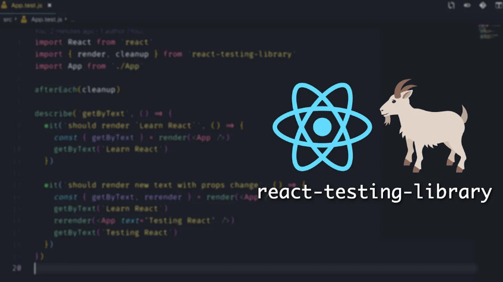

# Testando Aplicações ReactJs  
  
## Objetivo: 
Nesse projeto contém testes para uma aplicação React ultilizando a biblioteca **react-test-library**.

# Habilidades

Neste projeto, verificamos se você é capaz de:

* Utilizar os seletores (queries) da React-Testing-Library em testes automatizados.

* Simular eventos com a React-Testing-Library em testes automatizados.

* Testar fluxos lógicos assíncronos com a React-Testing-Library.

* Escrever testes que permitam a refatoração da estrutura dos componentes da aplicação sem necessidade de serem alterados.

* Criar mocks de APIs utilizando fetch.

* Testar inputs.

## Bibliotecas que contém neste projeto:
* **[ReactJs](https://pt-br.reactjs.org/)** - Biblioteca Front-end;
* **[react-test-library](https://testing-library.com/docs/react-testing-library/intro/)** - Biblioteca de testes em react.
​  
## Ilustração:

